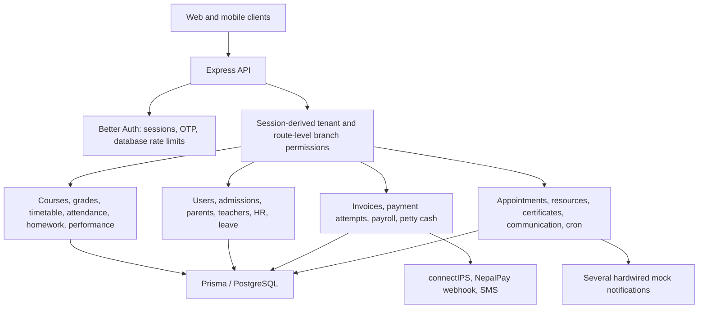

# Backend QA audit — 7 September 2026

**Overall assessment: 5/10. Release recommendation: hold production sign-off until the high-severity findings are fixed and verified.**

This is a risk-based source review of `services/api`, its Prisma schema, selected migrations, test files, and CI configuration. It is not a penetration test or a certification of every endpoint. Findings below are supported by code; reproduction scenarios are proposed regression tests, not claims of live exploitation.

## Backend map

The implemented backend is a tuition-management API, despite repository guidance and API documentation describing a Flutter task-management system.

Source inventory: 77 files under `services/api/src`; text search identified 185 route declarations. These are inventory counts, not a claim that every handler received equal review.

| Area | Main responsibility | QA assessment |
|---|---|---|
| Authentication | Login, sessions, OTP, reset, account status | Good foundations; response data exposure remains |
| Authorization | Tenant context, roles, branch and resource ownership | Explicit helpers exist, but enforcement is inconsistent |
| Academic workflows | Enrollment, schedules, attendance, grading | Ownership and daily-session workflow defects |
| Finance | Invoice lifecycle, gateways, manual review, petty cash | Some strong atomic transitions; overdue and webhook paths need correction |
| Operations | Appointments, maintenance, certificates, jobs | State transitions and delivery completeness need work |
| Persistence | PostgreSQL, Prisma, migrations | Decimal money fields and constraints present; relationship and race gaps remain |
| Quality gates | TypeScript, standalone tests, CI | Local checks pass; CI runs only a small part of backend tests |

## Scorecard

Scores reflect engineering judgment from this review, not measured coverage or benchmark results. Overall score is the equal-weight average, rounded to one decimal.

| Dimension | Score / 10 | Reason |
|---|---:|---|
| Architecture and maintainability | 6 | Clear domain routers and shared helpers; large handlers and stale documentation |
| Security and isolation | 4 | Session scope and OTP controls, undermined by hash exposure and ownership bypasses |
| Business-rule correctness | 4 | Billing, attendance, and appointment edge cases can affect real users |
| Data integrity and concurrency | 5 | Transactions in money workflows; inconsistent use elsewhere |
| Automated quality assurance | 5 | 17 passing test files, but limited CI execution and no database run in this audit |
| Operational readiness | 5 | Runtime validation and error IDs; mock jobs, shallow health check, delivery gaps |
| **Overall** | **5.0** | **Working foundation with release-blocking defects** |

## Findings, ordered by priority

### QA-01 — High: appointment listing exposes password hashes

Evidence: `services/api/src/routes/appointments.ts:205` includes the complete student `user` and returns `appointments` at line 208. `services/api/prisma/schema.prisma:255` defines `User.passwordHash`. Admission activation writes the same credential hash into both the user and credential account (`src/utils/admission-logins.ts:64`). No response redaction exists in this route.

Impact: a linked parent or assigned teacher can receive student password hashes plus unnecessary account fields. Hashes are sensitive even though they are not plaintext passwords.

Regression: create a student appointment, fetch `GET /api/appointments` as its teacher and parent, and assert recursively that `passwordHash` is absent. Use explicit Prisma `select` and response DTOs; review other full-user includes.

### QA-02 — High: tenant-admin bypass permits cross-tenant academic writes

Evidence: `src/routes/performance.ts:32` permits a tenant admin to proceed when the scoped student lookup returns null. The subsequent score creation uses the supplied `studentId`. The remarks route repeats the pattern at lines 67–73. Schema relations validate tenant and student separately, not their shared ownership.

Impact: an admin of tenant A who knows a student ID from tenant B can create a score or remark linked to that student, carrying tenant A's ID. This produces cross-tenant data corruption. Exposure in downstream views depends on their filters.

Regression: as tenant A's admin, post scores and remarks for tenant B's student; expect 404/403 and zero inserts. Always establish tenant ownership before applying role bypasses.

### QA-03 — High: overdue automation blocks students before payment is due

Evidence: `src/routes/cron.ts:33` updates every `UNPAID` invoice to `OVERDUE` without checking `dueDate`. The enrollment update at lines 37–44 has no current-status or invoice-branch restriction. The two updates are not one transaction.

Impact: invoices due in the future become overdue; all enrollments of an affected student can become blocked. A failure between updates leaves inconsistent state.

Regression: seed past-due and future-due invoices and multiple enrollment states/branches, then trigger `monthly-due-verification`. Only eligible past-due debt should affect eligible enrollments under the agreed policy. Apply due-date and lifecycle predicates within an atomic workflow.

### QA-04 — High: non-group appointments accept unauthorized participants

Evidence: `src/routes/appointments.ts:69` incorporates client-supplied `participantIds`, but line 70 validates them only when `isGroup` is true. The response endpoint grants authority based on membership in that saved list at line 115.

Impact: a parent can submit `isGroup: false` with their own user ID or an unrelated same-tenant user's ID and grant that account participant response rights, including rejection or proposing alternatives.

Regression: submit a normal teacher appointment with `participantIds: [parentUserId]`; the server should reject the extra participant or discard it. Validate all participants and derive the non-group list server-side.

### QA-05 — High: daily session generation can block same-day check-in

Evidence: `src/services/timetable-service.ts:19` generates today's sessions with `dailyUpdateSubmitted` defaulting to false. `src/routes/attendance.ts:81` blocks check-in for any pending session without requiring its date to precede today.

Impact: running the daily-session job before teachers arrive can prevent them from checking in until they submit a lesson update for a class that has not happened yet.

Regression: generate today's sessions, leave all earlier updates complete, then mark IN. Expect success. Yesterday's genuinely incomplete session should still enforce the intended policy. Use the Nepal calendar-day boundary consistently.

### QA-06 — High: NepalPay settlement unblocks unrelated unpaid enrollments

Evidence: `src/routes/finances.ts:1351` changes every blocked enrollment for the student to active when one invoice is paid, without evaluating other outstanding invoices or the relevant branch/enrollment.

Impact: settling one bill can restore access while other overdue debt remains. This differs from an invoice-specific settlement policy and can affect revenue controls.

Regression: create two overdue obligations for one student, settle only one with a valid signed callback, and check that unrelated debt still enforces the configured restriction. Centralize reconciliation of student/enrollment access across payment methods.

### QA-07 — Medium: public admission webhook passes an absent tenant context

Evidence: `src/routes/finances.ts:1366` calls `activateAdmissionAndSendLogins(req.tenantId!, ...)` from the unauthenticated NepalPay callback. The tenant middleware derives scope only from `req.user`; this route has no authenticated user. The non-null assertion does not create a runtime value. The invoice itself supplies the authoritative tenant.

Impact: admission delivery receives undefined tenant context after payment was committed. The delivery function uses this value in raw SQL and tenant-scoped delivery records, creating a failure path after successful settlement. Exact database error behavior was not executed here. A callback retry returns early for an already-paid invoice, so it does not retry this delivery path.

Regression: a valid signed admission callback should record payment and delivery against `invoice.tenantId`; simulate delivery failure and retry without duplicating the payment. Persist a retryable delivery job.

### QA-08 — Medium: notifications and some automation report work they do not perform

Evidence: `src/utils/notifications.ts:3` and `:24` only log/store messages and return success. Appointments and maintenance import these implementations directly. `src/routes/cron.ts:53` targets a placeholder phone, while petty-cash reset and contract-expiry branches at lines 64–67 only append success text.

Impact: users can believe reminders, appointment updates, and operational jobs have completed when no actual recipient delivery or job action occurred. The separate real SMS integration does not replace these direct mock imports.

Regression: exercise these flows with a provider test double and verify an addressed outbound request and persisted delivery outcome. Return an explicit unsupported/disabled result for unimplemented jobs.

### QA-09 — Medium: appointment approvals lose concurrent updates and allow invalid transitions

Evidence: `src/routes/appointments.ts:163` copies a previously read approvals JSON object and replaces it using an update by ID. Rejection and alternative proposals also update by ID without expected-current-state predicates.

Impact: simultaneous approvals can overwrite each other; rejected appointments can subsequently be approved; repeated alternative proposals can create additional linked requests.

Regression: race two different participant approvals and require both to survive; attempt approval after rejection and repeat the same alternative proposal. Define a transition table, use optimistic concurrency or locking, and make retries idempotent.

### QA-10 — Medium: certificate issue checks tenant membership but not student branch membership

Evidence: `src/routes/certificates.ts:241` independently loads a same-tenant student, template, and branch, but never verifies that the student is enrolled in the issuer's branch. The options endpoint filters available students, but direct API calls can bypass that UI list.

Impact: branch A's admin can issue a branch A certificate to a student belonging only to branch B in the same institution.

Regression: issue for a student enrolled only in another branch; expect 403/404. Enforce the relevant student-to-branch relationship at the mutation endpoint.

### QA-11 — Medium: resource logging is not atomic

Evidence: `src/routes/resources.ts:41` creates a resource log before separately creating a maintenance task, without a transaction. It also requires a Janitor even when `actionRequired` is false.

Impact: task creation failure leaves a saved log despite an error response; retrying can duplicate logs. Routine condition logs cannot be saved in a branch without a Janitor, even if no maintenance is needed.

Regression: force task creation to fail and assert neither row remains; submit an informational log without a Janitor and expect it to succeed. Commit related records atomically and perform assignment lookup only when required.

### QA-12 — Medium: backend tests are mostly absent from the default quality gate

Evidence: `.github/workflows/ci.yml:51` executes only the access-control backend test. `services/api/package.json` defines named test scripts but no `test` script, so root `npm test` with `--if-present` skips this backend's suites.

Impact: billing, webhook, payroll, validation, and route-authentication regressions can pass the normal test command and CI. Passing static middleware checks does not establish object-level authorization.

Regression: root `npm test` should discover and execute the backend suite, and CI should run it. Add an isolated PostgreSQL integration job covering negative authorization and concurrent transitions.

## Further concerns to verify

- `src/services/timetable-service.ts:36` checks for existing sessions before `createMany`, creating a concurrency window. The schema declares a non-unique index; inspect all deployed migration constraints and race two real job executions before concluding whether duplicate rows or a uniqueness error results.
- Several route operations and input accesses occur outside `try/catch`, including certificate issuance lookups. Verify rejected async operations reach the Express error boundary rather than escaping it.
- `/api/health` always reports UP without testing database readiness. Add a separate readiness check if orchestration depends on it.
- Appointment lists have no pagination. Measure representative large-tenant response sizes and latency rather than assuming a specific capacity ceiling.
- `docs/api/README.md` documents task/project routes and JWT refresh behavior that do not describe this implemented API. Replace it with actual endpoint contracts and authorization rules.

## Verification performed

- `npx.cmd --no-install tsc --noEmit -p services/api/tsconfig.json`: passed.
- Executed all 17 non-integration `*.test.ts` files through the installed `ts-node`: all passed. These cover calendar permissions/access, petty cash, route authentication, payroll helpers, timetable dates, access control, billing rules, connectIPS signing/reconciliation, financial calculations, Nepali dates, validation, runtime configuration, schedules, SMS normalization, and standard-grade billing.
- Some checks inspect source structure or use mocked persistence; passing them does not prove real database transactions or end-to-end flows.
- Did not execute the integration suite: its setup force-resets a fixed PostgreSQL schema, and this audit did not establish a disposable database. No database reset, live payment, SMS send, or production mutation was performed.
- No dependency advisory scan, load test, restore drill, or production configuration verification was performed. No security assurance is implied for those areas.
- Application code was not changed. Existing mobile-file modifications were left untouched.

## Recommended release sequence

1. Remove sensitive response fields and fix tenant/participant ownership checks (QA-01, QA-02, QA-04).
2. Correct overdue, access restoration, attendance gates, and webhook tenant propagation (QA-03, QA-05, QA-06, QA-07).
3. Add database-backed regression scenarios for every high-severity finding; verify concurrency and retry behavior.
4. Replace false-success notification/job paths and fix certificate/resource workflow boundaries.
5. Wire the full backend suite into CI, update API contracts, then perform staging integration and load verification.

Production sign-off should require zero open high-severity findings from this audit, passing isolated database tests, and demonstrable payment/delivery recovery after injected failures.
