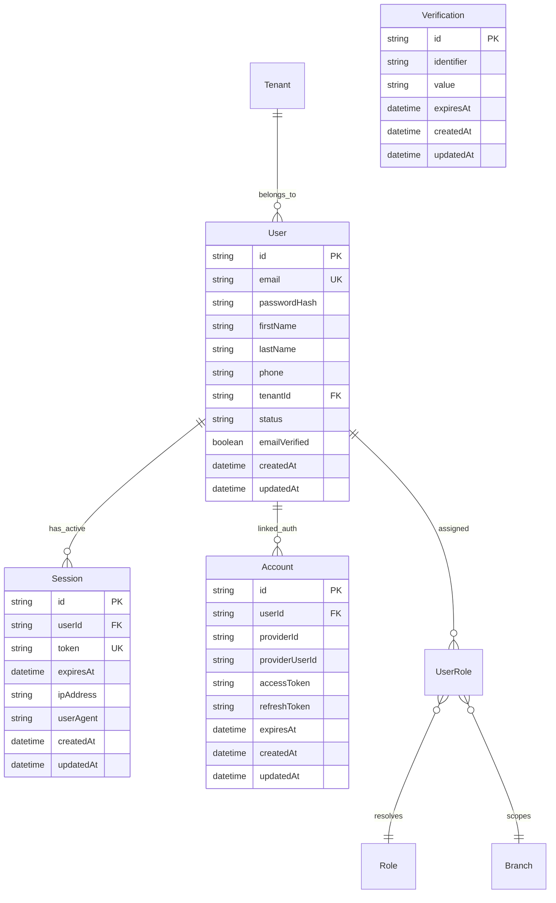
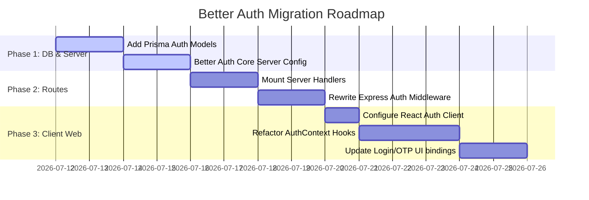

# Better Auth Integration & Codebase Audit Report
**Project:** Tuition Management System (TMS) Monorepo  
**Focus:** Authentication, Authorization, Tenant Isolation, and Web Audit  
**Date:** July 11, 2026

---

## 1. Executive Summary

This report performs a comprehensive audit of the authentication and authorization flows currently implemented in the Tuition Management System (TMS) codebase, focusing on the React web client (`apps/web`) and the Express/Prisma API service (`services/api`). 

We analyze the existing custom JWT authentication system, point out security and operational limitations, and provide a detailed blueprint for transitioning to **Better Auth**—a modern, TypeScript-first authentication framework. In accordance with requirements, this audit and blueprint focus strictly on the **web platform**, leaving mobile app integration for a separate phase.

---

## 2. Current Authentication Architecture

The repository currently implements a custom, token-based authentication mechanism. Below is an overview of how it operates on both the client and server sides.

### 2.1 Backend API Auth (`services/api`)
1. **Login Flow (`/api/auth/login`)**:
   - Accepts `email` and `password` via POST.
   - Extracts the tenant scope (`tenantId`) from the request context using the global `tenantMiddleware`.
   - Looks up the user in PostgreSQL via Prisma, joining their role assignments (`userRoles`) and core role permissions (`role`).
   - Compares the provided password against the stored bcrypt hash (`user.passwordHash`).
   - Signs a custom JWT using `jsonwebtoken` with a 24-hour expiration containing the `UserPayload`:
     ```typescript
     export interface UserPayload {
       id: string;
       email: string;
       firstName: string;
       lastName: string;
       tenantId: string;
       roles: {
         roleName: string;
         branchId: string | null; // null represents tenant-wide scope
         permissions: string[];
       }[];
     }
     ```
2. **Token Verification (`middleware/auth.ts`)**:
   - The `authMiddleware` intercepts incoming requests, extracts the JWT from the `Authorization: Bearer <token>` header, verifies the signature using a system secret key, and attaches the decoded payload to the Express request object as `req.user`.
3. **Role-Based Access Control (RBAC) & Scope Routing**:
   - An Express middleware `hasPermission(requiredPermission: string)` is used to secure endpoints.
   - It performs hierarchical permission validation:
     - **Super Admin**: Bypasses all permissions globally.
     - **Tenant Admin**: Bypasses permissions within their designated tenant context (`user.tenantId === req.tenantId`).
     - **Branch-level Roles (Teacher, Accountant, Student, etc.)**: Checks permissions against the active branch context, which is extracted dynamically from the request (`req.params`, `req.body`, `req.query`, or `x-branch-id` headers).

### 2.2 React Web Auth (`apps/web`)
1. **State Management (`context/AuthContext.tsx`)**:
   - Uses a React context-backed `AuthProvider` to manage session variables: `user`, `token`, `isLoading`, `isAuthenticated`, and `attemptCount`.
   - Supports remember-me session scopes:
     - **Persistent**: Persists the session token and user details to `localStorage`.
     - **Session**: Persists token and details to `sessionStorage` (cleared on browser close).
2. **API Client Integration (`services/api.ts`)**:
   - Re-attaches the token (`Authorization: Bearer <token>`) and tenant context (`X-Tenant-Id: <tenantId>`) as HTTP request headers for all outgoing API requests.
3. **Route Guards (`router/index.tsx`)**:
   - Protects pages via wrapper components:
     - `<RequireAuth />`: Redirects unauthenticated users to `/login`.
     - `<RequireRole allowedRoles={[...]} />`: Enforces path-level permission constraints and handles role-based redirects.
     - `<RequireTwoFactor />`: Directs administrators through the 2FA verify page before granting dashboard access.
4. **Mock Fallback Layer (`features/auth/service.ts`)**:
   - If the backend API service is unreachable, the frontend falls back to a simulated authentication flow using static mock accounts (e.g., `superadmin@tms.edu.np`, `admin@pinnacle.edu.np`) saved in local storage.
   - Two-Factor Authentication (2FA) codes and password reset requests are simulated client-side with a hardcoded verification code (`123456`).

---

## 3. Security & Architecture Audit (Web)

While the existing system successfully establishes multi-tenant separation and branch-level RBAC, it exhibits several architectural issues and security vulnerabilities:

| Risk Area | Current Implementation Details | Security/Operational Risk |
|---|---|---|
| **Session Lifetime & Revocation** | JWT tokens are stateless, signed with a fixed lifetime (24 hours), and stored on the client. | **High Risk**: There is no server-side mechanism to invalidate active tokens (e.g., on logout, user suspension, password change, or session hijacking) without maintaining a database-backed denylist. |
| **Token Storage** | Plain JWT tokens are stored directly in `localStorage` or `sessionStorage`. | **High Risk**: Direct exposure to Cross-Site Scripting (XSS) attacks. If an attacker injects a malicious script, they can read the token immediately from local storage and compromise the user account. |
| **Mock Authentication Injection** | Client-side code falls back to mocking user logins and bypassing API endpoints when the backend is down. | **Medium Risk**: While convenient for staging/development, having fallback mock account structures in production bundles increases the attack surface and can lead to code leakage or developer error. |
| **Custom 2FA & OTP Implementation** | 2FA verification codes are stored in sessionStorage with hardcoded OTP values (`123456`) and client-evaluated timers. | **Medium Risk**: Lacks cryptographic strength. Production requires integrating SMS and email gateways alongside secure server-side verification states, rate limits, and cryptographically random token generation. |
| **Tenancy Scope Desync** | Tenant context is read from a custom header (`X-Tenant-Id`) *and* validated inside the token. | **Low/Medium Risk**: If a client tempers with request headers, mismatch vulnerabilities can occur unless the server strictly enforces JWT claims over header values. |

---

## 4. What is Better Auth?

**Better Auth** is a comprehensive, production-ready TypeScript authentication engine that replaces standard custom-built auth logic. It features:

- **Database Adapters**: Integrates directly with Prisma, meaning it can use our existing PostgreSQL schema to manage tables.
- **Secure Cookie Sessions**: Session state is stored securely in database tables while the client uses HttpOnly, signed, and anti-CSRF cookies, mitigating XSS risks.
- **Built-in Plugins**:
  - **Multi-Factor Auth (2FA)**: Out-of-the-box support for email/SMS OTPs, TOTP, and backup codes.
  - **Organization (Multi-Tenancy)**: Provides built-in structures for organizations (tenants), roles, and member management.
  - **Account Lockout**: Rate-limiting login attempts and locking accounts automatically.
- **Unified Client Hooks**: Automatically generates client hooks for React (using Vite/Webpack), making session monitoring, logins, and logouts direct and clean.

---

## 5. Better Auth Migration Blueprint for TMS

To migrate the web platform to Better Auth without breaking the multi-branch RBAC design, we propose the following schema mapping, backend server initialization, and client-side setup.

### 5.1 Database Schema Modifications
Better Auth requires database tables for core user data and session control. We will map our existing `User` schema and introduce `Session`, `Account`, and `Verification` schemas into `schema.prisma`.



#### Updated `schema.prisma` Definitions:
```prisma
// Better Auth Core Tables

model User {
  id            String     @id @default(uuid())
  tenantId      String
  tenant        Tenant     @relation(fields: [tenantId], references: [id])
  email         String     @unique
  name          String?    // Combined first and last name or custom fallback
  firstName     String
  lastName      String
  phone         String
  passwordHash  String?    // Nullable if supporting Social OAuth providers later
  status        UserStatus @default(ACTIVE)
  emailVerified Boolean    @default(false)
  image         String?    // Profile avatar URL for Better Auth support
  createdAt     DateTime   @default(now())
  updatedAt     DateTime   @updatedAt

  // System Relations
  userRoles         UserRole[]
  staffRecord       StaffRecord?
  student           Student?
  parent            Parent?
  leaves            Leave[]
  teacherAttendance TeacherAttendance[]
  sessions          TeacherSession[]
  
  // Better Auth Relations
  authSessions      Session[]
  accounts          Account[]
}

model Session {
  id        String   @id @default(uuid())
  userId    String
  user      User     @relation(fields: [userId], references: [id], onDelete: Cascade)
  token     String   @unique
  expiresAt DateTime
  ipAddress String?
  userAgent String?
  createdAt DateTime @default(now())
  updatedAt DateTime @updatedAt
}

model Account {
  id           String    @id @default(uuid())
  userId       String
  user         User      @relation(fields: [userId], references: [id], onDelete: Cascade)
  accountId    String    // provider ID (e.g. "google", "credentials")
  providerId   String    // provider account ID
  accessToken  String?
  refreshToken String?
  expiresAt    DateTime?
  password     String?   // Used by Better Auth's credentials plugin
  createdAt    DateTime  @default(now())
  updatedAt    DateTime  @updatedAt
}

model Verification {
  id         String   @id @default(uuid())
  identifier String
  value      String
  expiresAt  DateTime
  createdAt  DateTime @default(now())
  updatedAt  DateTime @updatedAt
}
```

### 5.2 Server Configuration (`services/api/src/utils/auth.ts`)
The server instance configuration initializes Better Auth with the Prisma adapter, enables the `credentials` plugin for email/password validation, and integrates the `twoFactor` plugin.

```typescript
import { betterAuth } from "better-auth";
import { prismaAdapter } from "better-auth/adapters/prisma";
import { twoFactor } from "better-auth/plugins";
import prisma from "./db";

export const auth = betterAuth({
  database: prismaAdapter(prisma, {
    provider: "postgresql",
  }),
  emailAndPassword: {
    enabled: true,
    async authorize({ email, password }) {
      const user = await prisma.user.findUnique({
        where: { email },
      });
      if (!user || user.status !== "ACTIVE") {
        return null; // Triggers unauthorized error
      }
      
      // Password hash verification
      const bcrypt = require("bcryptjs");
      const isValid = await bcrypt.compare(password, user.passwordHash);
      if (!isValid) return null;

      return {
        id: user.id,
        email: user.email,
        name: `${user.firstName} ${user.lastName}`,
      };
    }
  },
  plugins: [
    twoFactor({
      sendOTP: async ({ user, code }) => {
        // Integrate real SMS/Email dispatch hooks here
        console.log(`Dispacthing 2FA code ${code} to ${user.email}`);
      },
    }),
  ],
  session: {
    expiresIn: 60 * 60 * 24, // 1 Day
    updateAge: 60 * 60 * 12, // Update cookie age after 12 hours
  },
  // Maps custom schema fields to better-auth payload
  user: {
    additionalFields: {
      tenantId: {
        type: "string",
        required: true,
      },
      status: {
        type: "string",
        required: true,
      }
    }
  }
});
```

### 5.3 Modifying API Routes & Middlewares
In `services/api/src/server.ts`, we redirect authentication requests to Better Auth handlers:

```typescript
import { toNodeHandler } from "better-auth/node";
import { auth } from "./utils/auth";

// Mount Better Auth router
app.all("/api/auth/*", toNodeHandler(auth));
```

The updated backend `authMiddleware` inside `services/api/src/middleware/auth.ts` will verify sessions using Better Auth's core validation utility rather than manually decoding JWT headers:

```typescript
import { Response, NextFunction } from 'express';
import { TenantRequest } from './tenant';
import { auth } from '../utils/auth';
import prisma from '../utils/db';

export async function authMiddleware(req: TenantRequest, res: Response, next: NextFunction) {
  try {
    // Better Auth extracts cookies or Bearer token header automatically
    const session = await auth.api.getSession({
      headers: req.headers,
    });

    if (!session || !session.user) {
      return res.status(401).json({ error: 'Access denied. No active session.' });
    }

    // Retrieve user roles and branch scopes from db
    const userWithRoles = await prisma.user.findUnique({
      where: { id: session.user.id },
      include: {
        userRoles: {
          include: { role: true }
        }
      }
    });

    if (!userWithRoles) {
      return res.status(401).json({ error: 'User session invalid.' });
    }

    // Bind roles list to request context
    req.user = {
      id: userWithRoles.id,
      email: userWithRoles.email,
      firstName: userWithRoles.firstName,
      lastName: userWithRoles.lastName,
      tenantId: userWithRoles.tenantId,
      roles: userWithRoles.userRoles.map(ur => ({
        roleName: ur.role.name,
        permissions: Array.isArray(ur.role.permissions) ? (ur.role.permissions as string[]) : [],
        branchId: ur.branchId,
      })),
    };

    next();
  } catch (error) {
    return res.status(401).json({ error: 'Invalid or expired session.' });
  }
}
```

### 5.4 React Web Client Integration (`apps/web`)
1. **Initialize Client (`apps/web/src/services/authClient.ts`)**:
   ```typescript
   import { createAuthClient } from "better-auth/react";
   import { twoFactorClient } from "better-auth/client/plugins";

   export const authClient = createAuthClient({
     baseURL: "http://localhost:3001",
     plugins: [
       twoFactorClient(),
     ]
   });
   ```
2. **Replacing Custom `AuthContext`**:
   We can replace the custom handlers inside `AuthContext.tsx` with hooks provided by `authClient`:
   ```typescript
   import { authClient } from "../services/authClient";

   export function AuthProvider({ children }: { ReactNode }) {
     const { data: session, isPending: isLoading } = authClient.useSession();
     
     // Login handler using Better Auth
     const login = async (email: string, password: string) => {
       const { data, error } = await authClient.signIn.email({
         email,
         password,
       });
       if (error) throw new Error(error.message);
     };

     const logout = async () => {
       await authClient.signOut();
     };

     // ... keep existing path-based navigation and role checking mapping ...
   }
   ```

---

## 6. Audit Verdict & Migration Road Map

### 6.1 Audit Verdict
The current custom implementation is functional for initial deployments but presents **high-risk architectural issues** in production setups (lack of session revocation mechanisms, plain storage of JWT secrets in localStorage, and lack of real server-side OTP token checks). 

Optionally transitioning the **Web** platform to Better Auth is highly recommended to align the codebase with modern security standards (HttpOnly session cookies, active session management, cryptographic OTP flows).

### 6.2 Phased Action Items (Web Only)



1. **Step 1 (Schema & DB Migration)**:
   - Append `Session`, `Account`, and `Verification` schemas to `schema.prisma`.
   - Run `npx prisma migrate dev --name add_better_auth_core` to apply changes to database.
2. **Step 2 (API Core & Endpoint setup)**:
   - Install `@tms/api` dev dependencies: `npm i better-auth`.
   - Setup `services/api/src/utils/auth.ts`.
   - Mount `/api/auth/*` handlers inside Express server.
3. **Step 3 (Middleware migration)**:
   - Update `authMiddleware` in `services/api/src/middleware/auth.ts` to utilize `auth.api.getSession`.
   - Validate that route guards (`hasPermission`) work seamlessly under new sessions.
4. **Step 4 (Frontend Integration)**:
   - Replace the local mock data simulation inside `apps/web/src/features/auth/service.ts` with the Better Auth client interactions.
   - Refactor `AuthContext.tsx` to read user data and loading statuses from `authClient.useSession()`.
   - Remove plaintext JWT token storage from localStorage/sessionStorage. Use HttpOnly cookies or fallback client mechanisms managed by Better Auth.
