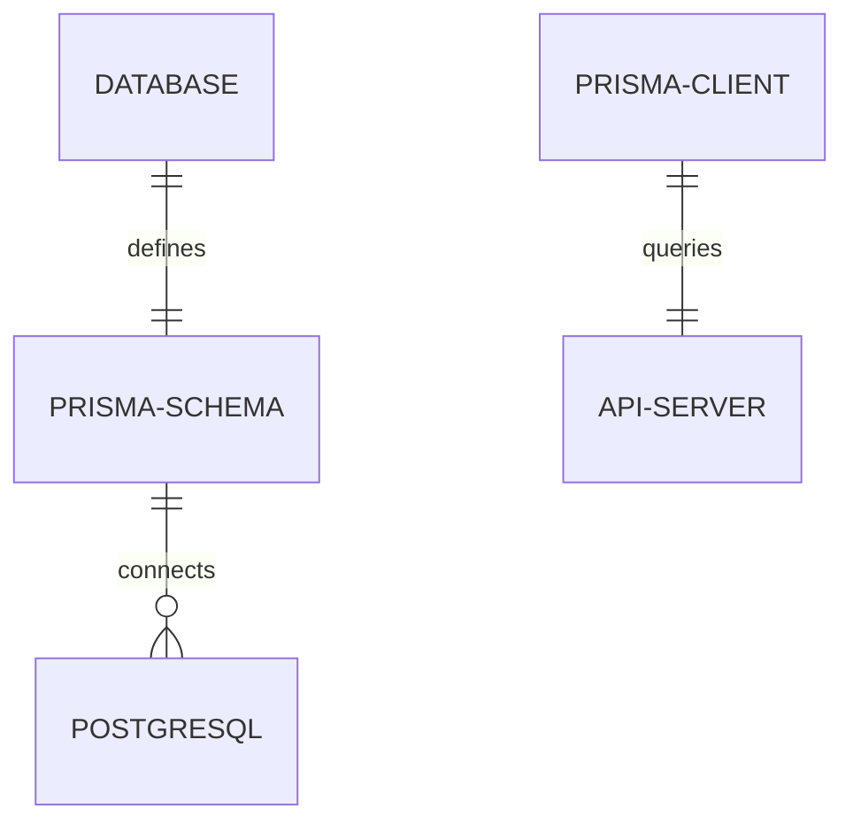

# TMS System Architecture & Technology Stack Audit Report
**Project:** Tuition Management System (TMS) Monorepo  
**Focus:** Database, Backend Service, Web Client, Monorepo Structure, and CI Pipeline  
**Date:** July 11, 2026

---

## 1. Executive Summary

The Tuition Management System (TMS) is structured as a TypeScript-first monorepo using **npm workspaces**. It provides a multi-tenant, branch-scoped application architecture for handling student enrollment, fee collection, staff/teacher geo-attendance, leave approvals, and dashboard analytics.

---

## 2. Core Database Layer

* **Database Engine**: **PostgreSQL**
* **Database Connection & Mapping**: **Prisma ORM** (`prisma-client-js` generator)



### 2.1 Schema Overview & Relationships
Prisma maps the PostgreSQL database tables. Key characteristics include:
- **Logical Multi-Tenancy**: All tables containing tenant-specific records (e.g., `Branch`, `User`, `Course`, `Student`, `StaffRecord`, `Invoice`) contain a foreign key `tenantId` pointing to the `Tenant` table to achieve logical row-level isolation.
- **Hierarchical Branch Scope**: Records such as `Leave`, `TeacherAttendance`, and `Class` are scoped by `branchId` to support multi-branch academies under a single tenant.
- **Cleaned optional relations**: Relationship properties for cashless canteen wallets and student transit routes have been fully removed from the `Tenant` and `Student` schemas.

---

## 3. Backend API Service (`services/api`)

The backend functions as a modular REST API built with Node.js and Express.

| Technology | Purpose | Implementation Details |
|---|---|---|
| **TypeScript** | Static Typing | Configured via `tsconfig.json` targeting Node.js ES2022. |
| **Express.js** | REST Framework | Routes are organized into domain-specific modules and mounted in `server.ts`. |
| **ts-node & nodemon** | Live Reloading | Runs source typescript directly during development using nodemon watchers. |
| **jsonwebtoken** | Session Authentication | Signs and verifies stateless JWT tokens holding user roles, tenant scopes, and branch authorizations. |
| **bcryptjs** | Password Hashing | Secures administrator, teacher, and student credentials at rest. |

### 3.1 Custom Middleware Stack
- **`tenantMiddleware`**: Detects and binds the active tenant scope (`req.tenantId`) from incoming request headers (`x-tenant-id`) or the user's JWT claims.
- **`authMiddleware`**: Decodes and verifies incoming stateless JWT bearer tokens, attaching user roles, scopes, and identifiers to `req.user`.
- **`hasPermission(permission)`**: Performs access-control validation based on hierarchical roles (Super Admin, Tenant Admin, and Branch Admin).

---

## 4. Frontend Web Client (`apps/web`)

The web client is a single-page application (SPA) built with React and compiled via Webpack.

| Technology | Purpose | Implementation Details |
|---|---|---|
| **React 19** | UI Library | Built using modern functional components, context states, and standard lifecycle hooks. |
| **React Router v6** | Routing | Manages client-side route mapping, redirects, and path-level role access guards. |
| **Webpack 5** | Module Bundling | Customized in `webpack.config.js` to parse assets, compile TypeScript files, and bundle resources. |
| **ts-loader** | TS Compilation | Processes React components (`.tsx`) and TypeScript utilities (`.ts`) targeting ES module generation. |
| **Vanilla CSS** | Styling | Avoids TailwindCSS in favor of a curated design system (`index.css`) containing HSL color variables, smooth typography rules, glassmorphic layout panel styles, and micro-animations. |

### 4.1 Frontend API client wrapper (`services/api.ts`)
- Implements custom wrappers wrapping standard browser fetch commands.
- Automatically injects the active authentication token (`Authorization: Bearer <token>`) and tenant context (`X-Tenant-Id`) into all outbound request headers.
- Handles authorization redirects to `/login` on token expiry.

---

## 5. Monorepo & Pipeline Infrastructure

### 5.1 Project Layout (npm Workspaces)
The repository is managed as an npm monorepo scoped in the root `package.json`:
```json
"workspaces": [
  "apps/web",
  "packages/types",
  "services/api"
]
```
- **`apps/web`**: Webpack React client application.
- **`packages/types`**: Shared types package (e.g., `UserPayload`, `BillingDetails`) exported to the API and web packages.
- **`services/api`**: Express backend service.
- **`packages/ui-login`**: Static mock mockup page using CDN Tailwind (completely independent and free of node compiler scripts).

### 5.2 CI Pipeline (`.github/workflows/ci.yml`)
Runs build verification steps automatically on push and pull-requests to the `main` and `develop` branches:
- **Environment**: Ubuntu runner on **Node 22** (avoiding deprecated Node 20 runtimes).
- **Dependency Caching**: Caches global node modules using the root `package-lock.json` dependency path.
- **Build Checks**: Executes `npm run build --workspace=web` to compile TypeScript and bundle Webpack assets to ensure build integrity before delivery.
